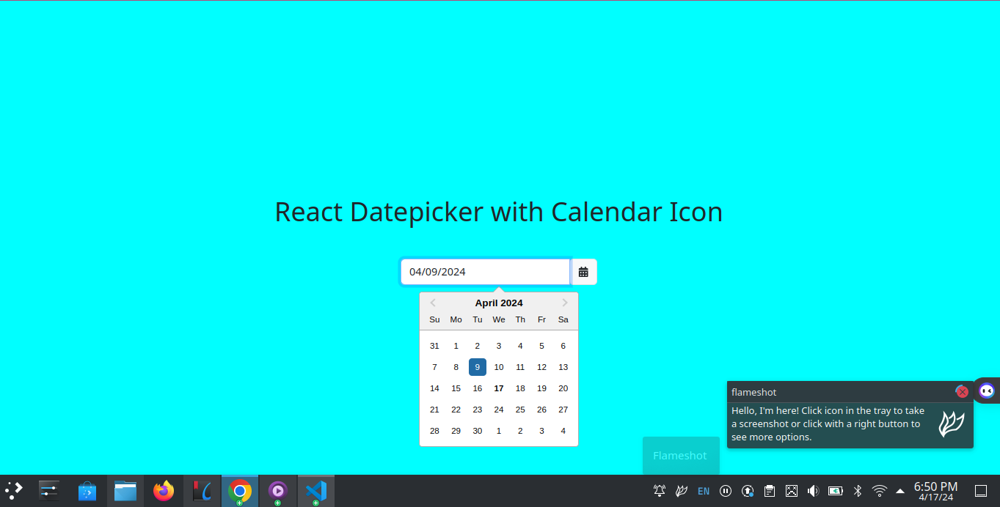

# React Datepicker with Calendar Icon

Welcome to the React Datepicker with Calendar Icon project! This React application showcases a user-friendly datepicker integrated with a convenient calendar icon for efficient date selection.

This project is a simple React application that demonstrates the use of a datepicker with a calendar icon.

## Screenshot

## Installation

To install the project, follow these steps:

1. Clone the repository: `git clone <repository-url>`
2. Install the dependencies: `npm install`
3. Start the application: `npm run dev`

## Usage

Select a date from the datepicker. The selected date will be displayed.

## Author

This project is crafted by KALUNGI JOSHUA EDWARD, a skilled MERN stack developer dedicated to enhancing user experiences through innovative solutions.

- **Email:** [joshuakalungi101@gmail.com](mailto:joshuakalungi101@gmail.com)
- **Phone:** [+256758518110]
- **Workstation:** [Criokk Designs]
- **Position:** [Junior Software Developer]

For inquiries, collaborations, or further information, feel free to reach out. Let's build something amazing together!

## License

This project is licensed under the MIT License.